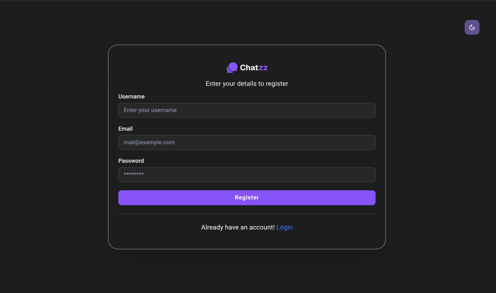
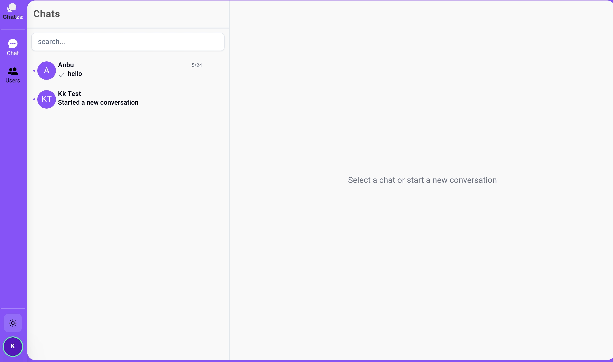
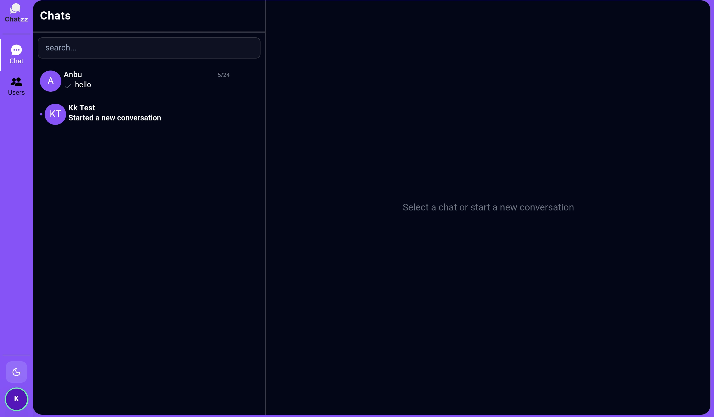
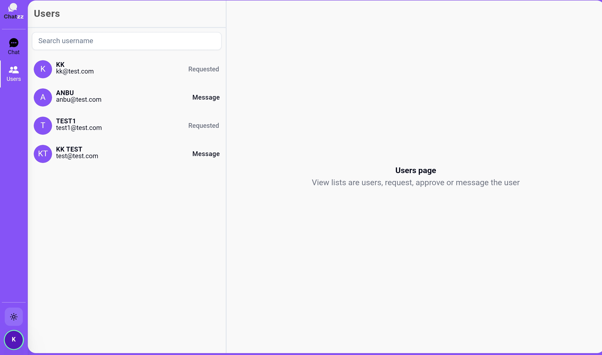
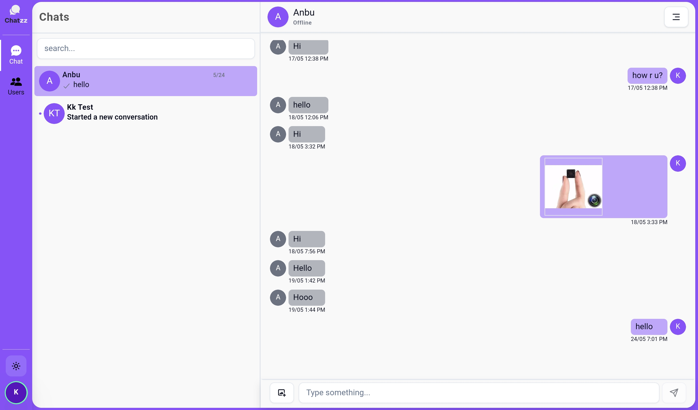

# 💬 Chatzz – Real-Time Chat Application

**Chatzz** is a modern real-time one-to-one chat application built with a clean UI and smooth user experience. It supports user authentication, chat requests, messaging, and user discovery with both light and dark themes.

🚀 **Live Demo**: https://chatzz-peach.vercel.app/login  
📦 **GitHub Repo**: https://github.com/smartkeerthi/chatzz

---

## ✨ Features

- 🔐 User Registration & Login
- 👤 User discovery and search
- 🤝 Send & manage chat requests
- 💬 One-to-one real-time messaging
- 🟢 Online / Offline user status
- 🌓 Light & Dark mode support
- 📱 Responsive modern UI
- 🖼️ Image sharing in chat
- 📜 Chat history persistence

⚠️ **Note**: Email verification during user registration is currently **disabled**.

---

## 🛠️ Tech Stack

- **Frontend**: Next.js, React
- **Styling**: CSS / Modern UI components
- **Backend**: Node.js
- **Database**: Prisma ORM
- **Real-time Communication**: Pusher
- **Authentication**: Custom auth flow
- **Deployment**: Vercel

---

## 📸 Screenshots

- Login & Registration pages
- Chat list & conversation view
- Users page with request & messaging actions
- Dark & Light mode UI








---

## ⚙️ Getting Started

### 1️⃣ Clone the Repository
```bash
git clone https://github.com/smartkeerthi/chatzz.git
cd chatzz
```

### 2️⃣ Install Dependencies
```bash
npm install
```

### 3️⃣ Setup Environment Variables

Create a `.env` file and add:
```env
DATABASE_URL=your_database_url
PUSHER_APP_ID=your_pusher_app_id
PUSHER_KEY=your_pusher_key
PUSHER_SECRET=your_pusher_secret
NEXT_PUBLIC_PUSHER_KEY=your_public_pusher_key
```

### 4️⃣ Run the Application
```bash
npm run dev
```

App will run at: 👉 `http://localhost:3000`

---

## 📌 Future Enhancements

- ✅ Email verification
- 🔒 Password reset
- 👥 Group chat support
- 📎 File sharing
- 🔔 Push notifications

---

## 🙌 Author

**Keerthivasan K**

- GitHub: https://github.com/smartkeerthi
- Portfolio: https://keerthivasan-portfolio.netlify.app/

---

⭐ If you like this project, don’t forget to **star** the repository!
